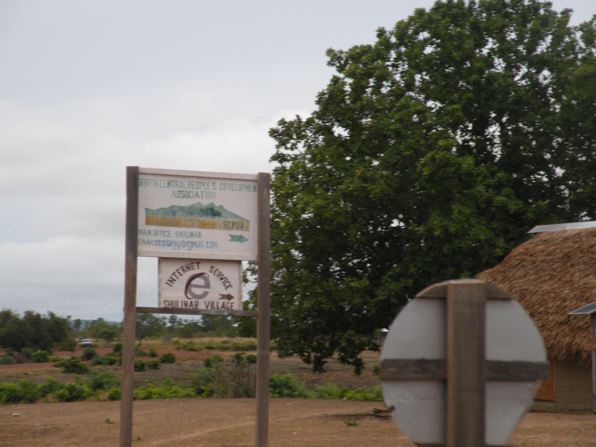
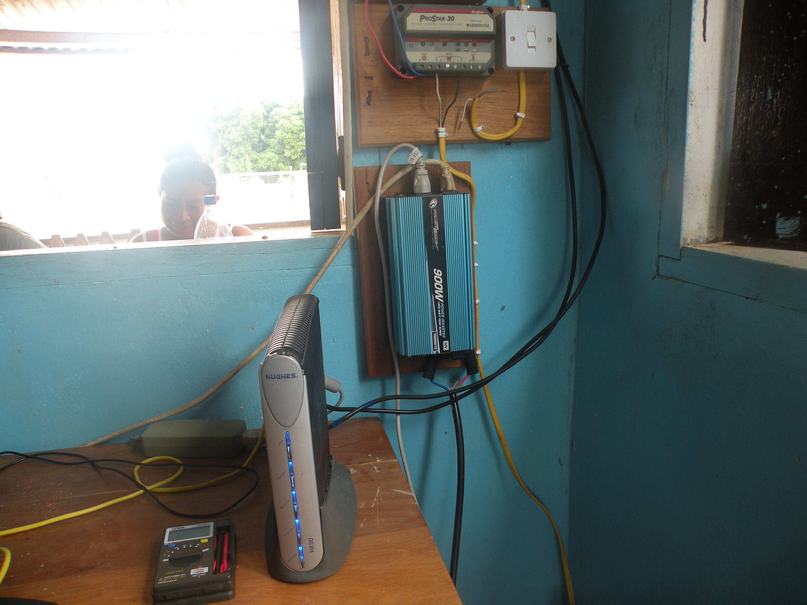
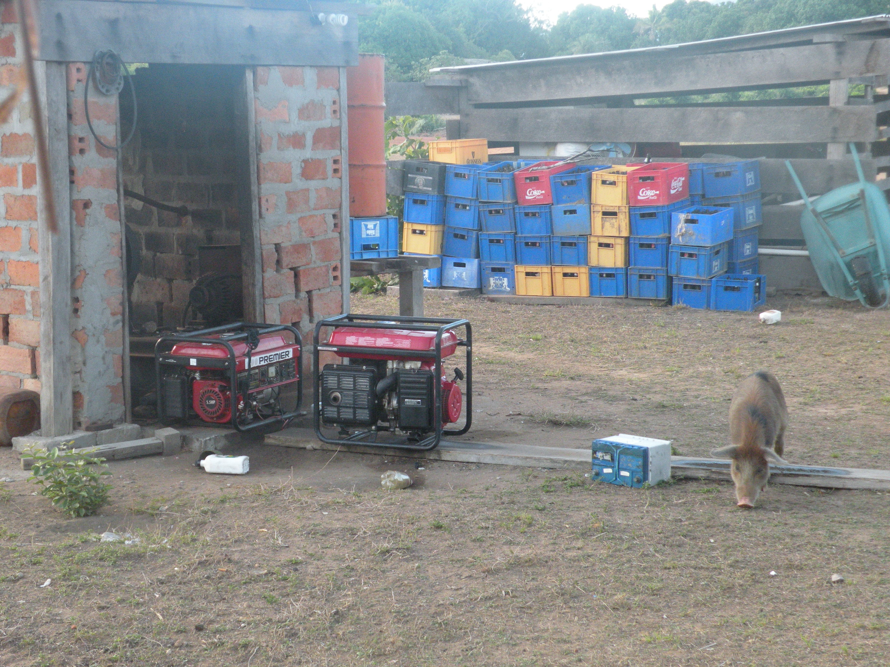
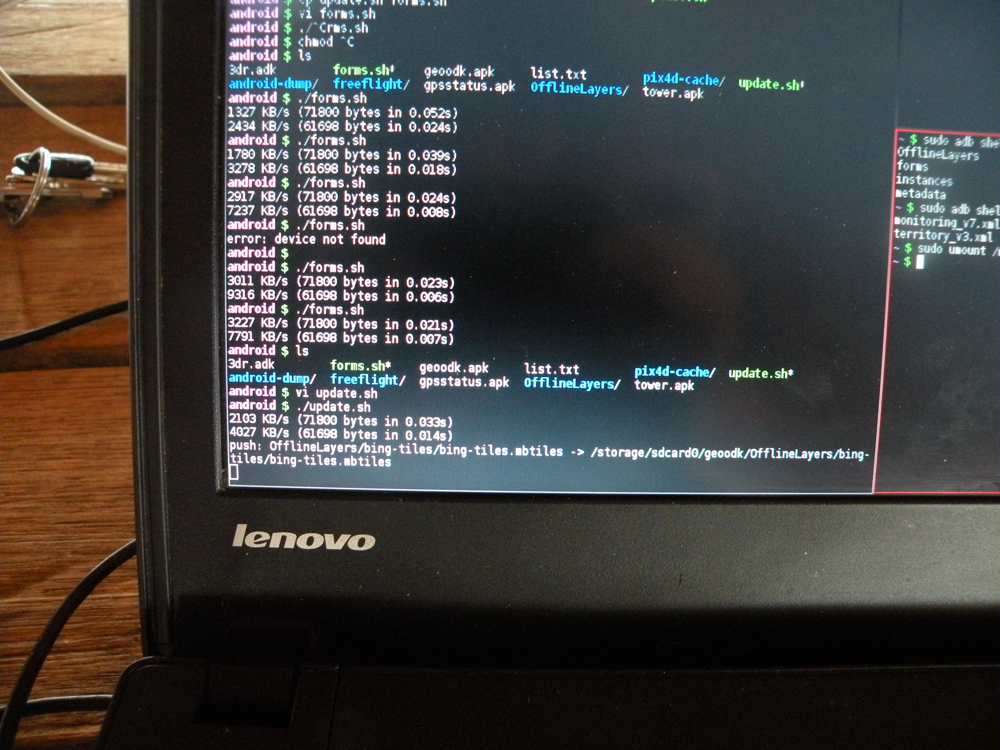
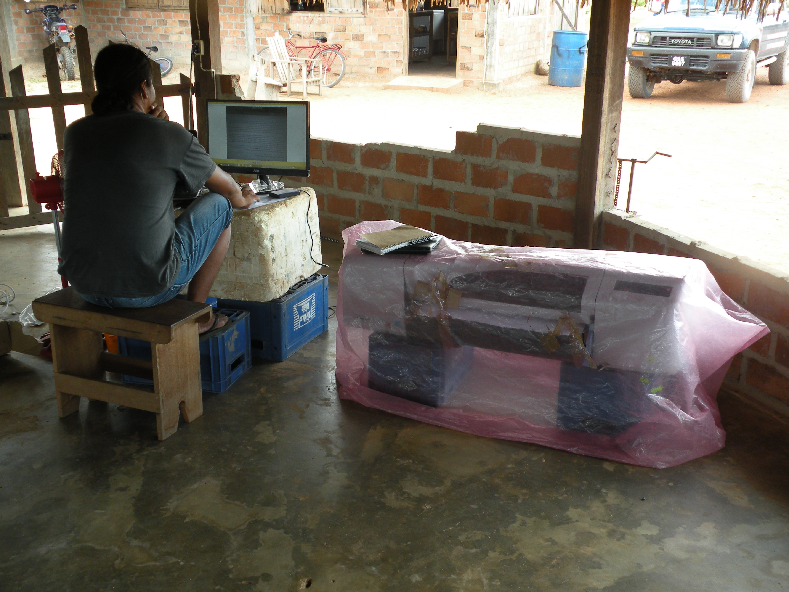
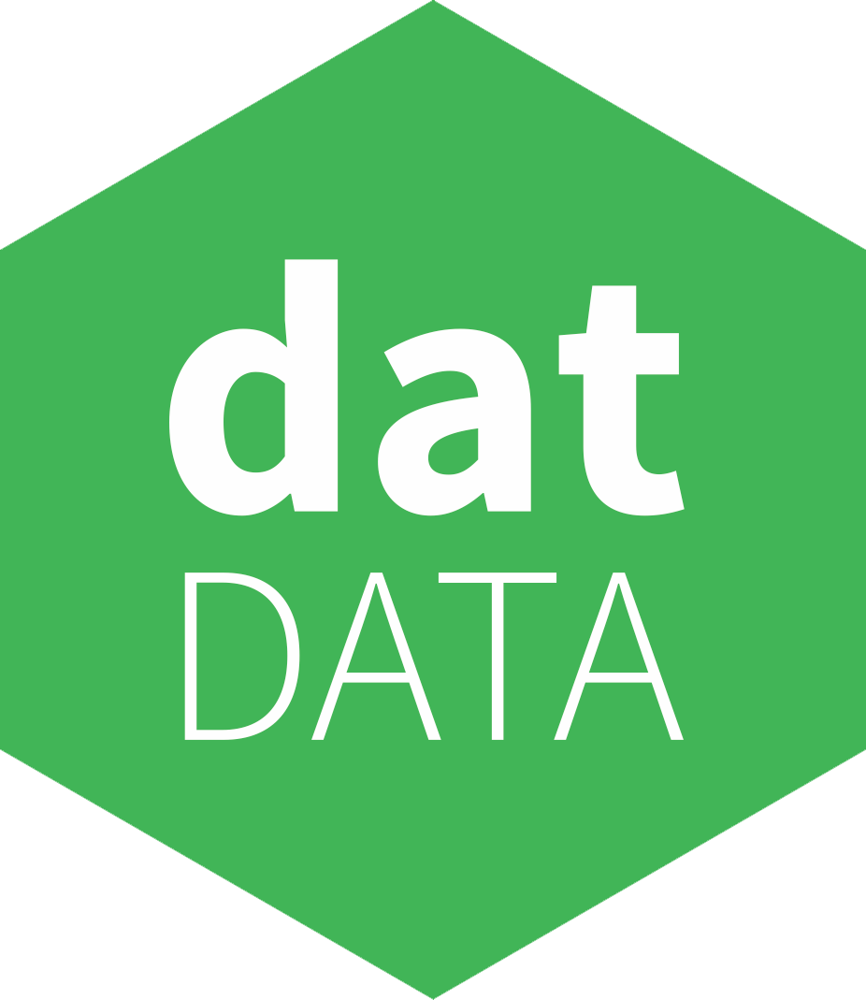

# p2p off the grid

James Halliday

https://substack.neocities.org

---
# peermaps

p2p mad science map project

---
# peermaps

p2p mad science map project

...contacted by Digital Democracy
  to build this tool for real users

---
# the work

inform the local political process

* accurate territory maps
* monitoring oil spills, mining, logging, borders

---
# the work

tools to support already-existing political organization

long-term partnerships in ecuador, peru, guyana

---
# guyana

shulinab village in wapichan territory, guyana



---
# p2p tricks

---


---
# the tools

* garmin gps devices
* sealed android phones (running geoodk)
* windows laptops       (running mapfilter and dd-map-editor)
* drones
* paper notepad

---
# unique challenges

* no electrical grid
* unreliable internet, low cell phone coverage
* seasonal roads

---
# unique challenges

* no electrical grid
* unreliable internet, low cell phone coverage
* seasonal roads
* ALSO: every device is riddled with viruses

---
# power

* generators
* solar power
* vehicles

---
# solar power


---
# solar power



---
# generators



---
# internet

* satellite uplink: expensive, capped

---
# putting software on phones



---
# putting software on phones

```
#!/bin/bash

DIR=/storage/sdcard0/geoodk

sudo adb push ~/data/odk/forms/monitoring_v7.xml $DIR/forms/ \
&& sudo adb push ~/data/odk/forms/territory_v3.xml $DIR/forms/ \
&& sudo adb shell "rm -f $DIR/forms/monitoring_v6.xml" \
&& sudo adb shell "rm -f $DIR/forms/territory_v2.xml" \
&& sudo adb push OfflineLayers $DIR/OfflineLayers
```

---
# putting software on phones

PROBLEM:

people can't flash new/broken phones themselves,
requires internet or expert skills

---
# digital mapping

one person has a laptop running arcmap



---
# digital mapping

what if everyone had a copy of the map they could edit?

---
# why p2p?

* remove human bottlenecks
* redundant copies
* any device can show what's happening

---
# why javascript?

use the same libraries on:

* web browsers
* android phones
* laptops
* ???

---
# osm-p2p-db: what

p2p database implementing the OpenStreetMap schema

https://github.com/digidem/osm-p2p-db
https://github.com/digidem/osm-p2p-server
https://github.com/digidem/osm-p2p-observations

---
# osm-p2p-db: how

updates written to an append-only log (using hyperlog)

materialized views sit on top of this log:

* hyperkv                 p2p key/value store
* hyperlog-kdb-index      p2p geospatial index

(kappa architecture)

---
# osm-p2p-observations

associate media with 

using hyperdrive



---
# remote data transfer

sneakernet!

* take a usb drive with you when you visit another village
* plug the usb drive into a mapping computer
* take the usb drive back with you

now both computers have the same data

---
# dd-map-editor

demo!

---
# aljazeera coverage

```
$ youtube-dl http://video.aljazeera.com/channels/eng/videos/amazon-tribes-use-latest-gadgets-to-battle-ecuadors-oil-giants/4903619810001
$ ./play.sh
```

---
# links

* http://mike.teczno.com/notes/guyana-trip-report.html
* http://video.aljazeera.com/channels/eng/videos/amazon-tribes-use-latest-gadgets-to-battle-ecuadors-oil-giants/4903619810001
* http://digital-democracy.org/
* https://github.com/digidem/osm-p2p-db/blob/master/doc/architecture.markdown

---
# internet update

```
19:42 < ddem-bot> <gregor> that’s true. That internet guy Deji actually went out there two 
                  weeks ago and installed a new modem, he was in Shulinab for 3 days testing 
                  and fixing, and kept emailing me with updates. I guess he felt the pressure!
19:43 < ddem-bot> <gregor> They have a new modem now, which apparently is working better, and I 
                  even had a skype conversation with Tessa and it was clear.
```

---

