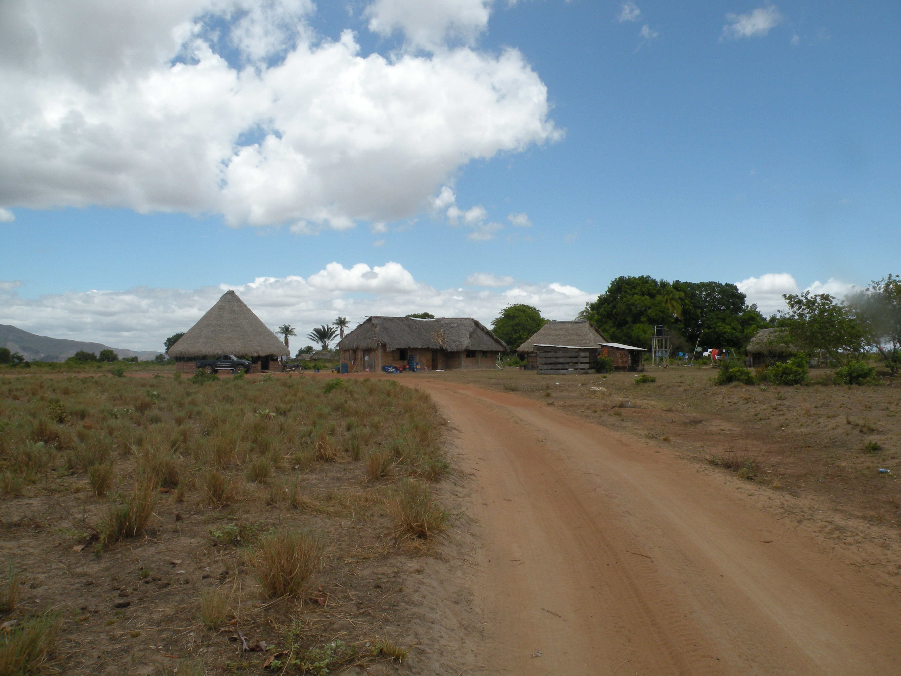
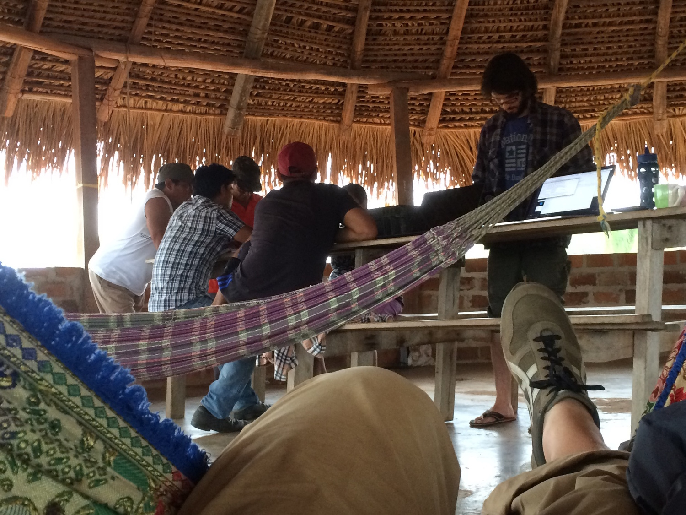
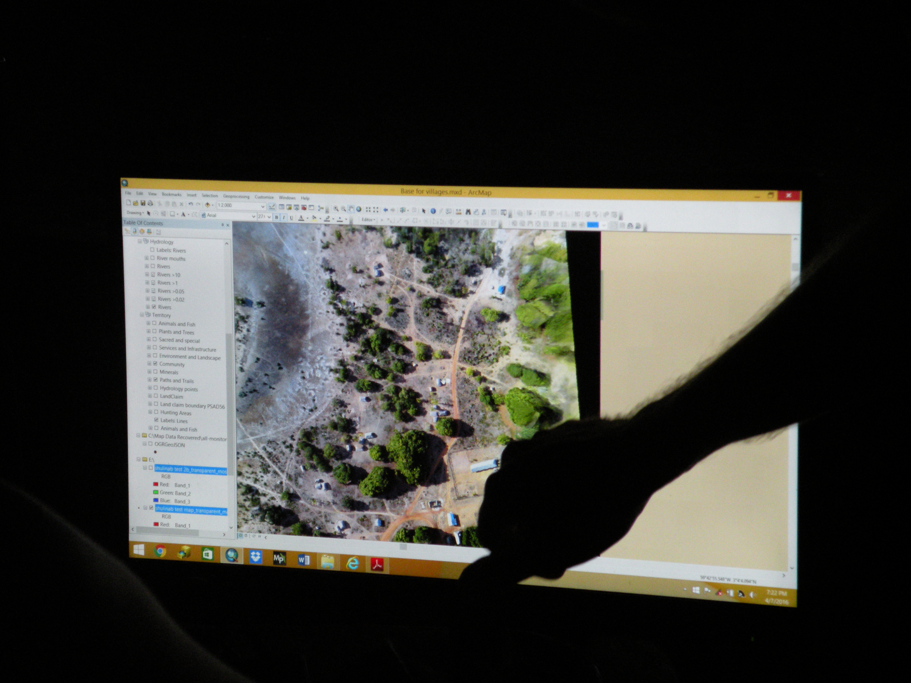
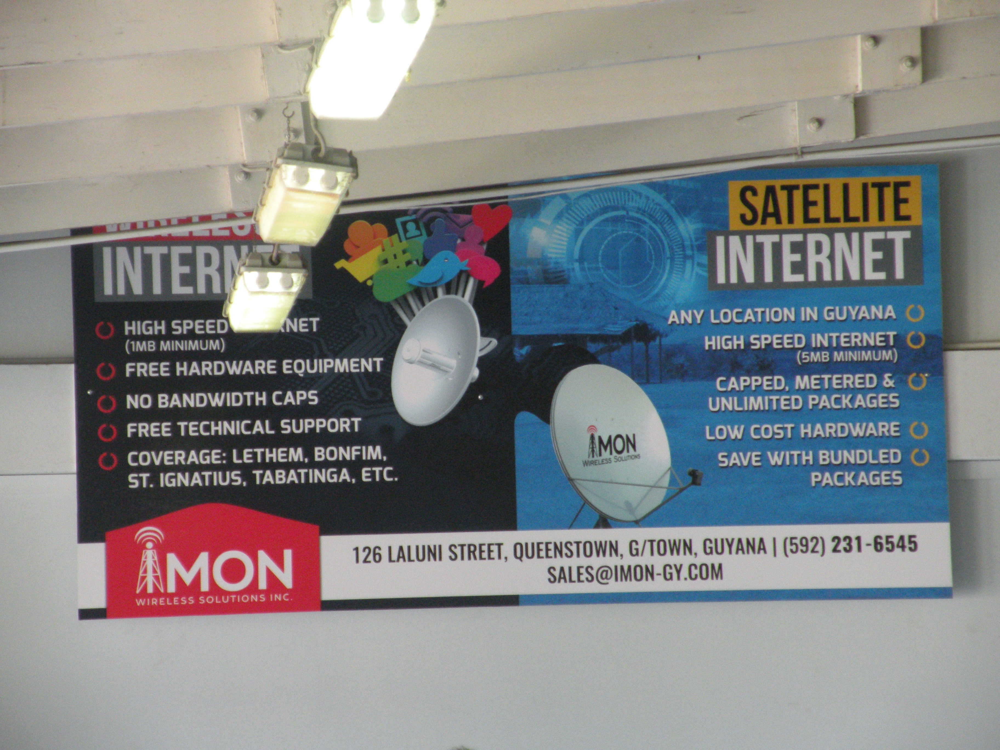
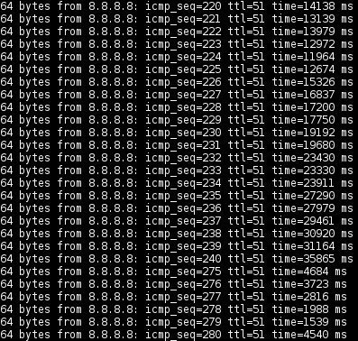

# p2p off the grid

James Halliday

https://substack.neocities.org

---
# peermaps

p2p mad science map project

---
# peermaps

p2p mad science map project

...contacted by Digital Democracy
  to build this tool for real users

---
# the work

inform the local political process

* accurate territory maps
* monitoring oil spills, mining, logging, borders

---
# the work

tools to support already-existing political organization

long-term partnerships in ecuador, peru, guyana

combination tech support and novel software development

---
# shulinab

shulinab village in wapichan territory, guyana


---
# shulinab



---
# shulinab


---
# shulinab



---
# the tools

* garmin gps devices
* sealed android phones (running geoodk)
* windows laptops       (running mapfilter and dd-map-editor)
* drones
* paper notepad

---
# satellite imagery

the Amazon is very cloudy!

---
# drones



---
# unique challenges

* no electrical grid
* unreliable internet, low cell phone coverage
* seasonal roads

---
# unique challenges

every device is riddled with viruses (!!!)

---
# power

* generators
* solar power
* vehicles

---
# solar power


---
# solar power


---
# generators


---
# satellite internet: expensive, capped



---
# satellite internet

stops working when you reach the data cap

easy to use a whole month of data when there's
an android or windows update

downloading the same exact files, multiple times!

---
# internet on a good day


---
# internet on a typical day



---
# internet update

```
<gregor> They have a new modem now, which apparently is
  working better, and I even had a skype conversation
  with Tessa and it was clear.
```

---
# putting software on phones, offline!


---
# putting software on phones, offline!

```
#!/bin/bash

DIR=/storage/sdcard0/geoodk

sudo adb push ~/data/odk/forms/monitoring_v7.xml $DIR/forms/ \
&& sudo adb push ~/data/odk/forms/territory_v3.xml $DIR/forms/ \
&& sudo adb shell "rm -f $DIR/forms/monitoring_v6.xml" \
&& sudo adb shell "rm -f $DIR/forms/territory_v2.xml" \
&& sudo adb push OfflineLayers $DIR/OfflineLayers
```

---
# putting software on phones, offline!

PROBLEM:

people can't flash new/broken phones themselves,
requires internet or expert skills

---
# digital mapping

one person has a laptop running arcmap


---
# digital mapping

what if everyone had a copy of the map they could edit?

---
# why p2p?

* remove human bottlenecks
* redundant copies
* any device can show what's happening

---
# p2p and offline: not so different!

You can always (read+write) local data offline.

Need to have data locally to participate in p2p.

---
# p2p tricks

free your mind from the idea...

that a key should map to a single value

(multi-value register conflict strategy)

---
# why javascript?

use the same libraries on:

* web browsers
* android phones
* laptops (with electron)
* ???

database: level or level-browserify

block storage: fs or indexeddb

---
# osm-p2p-db: what

p2p database implementing the OpenStreetMap schema

* https://github.com/digidem/osm-p2p
* https://github.com/digidem/osm-p2p-db
* https://github.com/digidem/osm-p2p-server
* https://github.com/digidem/osm-p2p-observations

---
# osm-p2p-db: how

updates written to an append-only log (using hyperlog)

materialized views sit on top of this log:

* hyperkv                 p2p key/value store
* hyperlog-kdb-index      p2p geospatial index

(kappa architecture)

---
# osm-p2p-server

speaks the [OSM http API][1]

so we can use tools like [ideditor](http://ideditor.com/)
with our p2p database

[1]: http://wiki.openstreetmap.org/wiki/API_v0.6

---
# osm-p2p-observations

associate evidence media with locations

using hyperdrive for p2p blob replication

and hyperdrive-index to build materialized views
for JPEG exif data and thumbnails


---
# p2p

legos bricks for offline/p2p!

* hyperlog
* hyperlog-index
* hyperkv

---
# hyperlog

append-only log (merkle DAG, like git)

``` js
var hyperlog = require('hyperlog')
var level = require('level')
var db = level('map.db')

var log = hyperlog(db, { valueEncoding: 'json' })

var msg = process.argv[2]
var links = process.argv.slice(3)
log.add(links, { message: msg }, function (err, node) {
  console.log(node.key)
})
```

---
# hyperlog: replicate

given two hyperlogs, connect them together
with a stream and they will sync!

``` js
net.createServer(function (stream) {
  stream.pipe(log.replicate()).pipe(stream)
}).listen(5000)
```

``` js
var stream = net.connect()
stream.pipe(log.replicate()).pipe(stream)
```

---
# hyperlog-index

generate indexes (materialized views) for a hyperlog

``` js
var dex = indexer({
  log: log,
  db: db,
  map: function (row, next) {
    // write each document to another store here...
    // then call next()
  })
})
```

---
# hyperkv

p2p key/value store

``` js
var kv = hyperkv({ log: log, db: db })

kv.put(key, value, function (err, node) {
  //...
})

kv.get(key, function (err, values) {
  // values, not value
})
```

---
# remote data transfer

sneakernet!

* take a usb drive with you when you visit another village
* plug the usb drive into a mapping computer
* take the usb drive back with you

now both computers have the same data!

---
# dd-map-editor

application using all the aforementioned libraries,
and sneakernet usb replication

demo!

---
# aljazeera coverage

```
$ youtube-dl http://video.aljazeera.com/channels/eng/videos/amazon-tribes-use-latest-gadgets-to-battle-ecuadors-oil-giants/4903619810001
$ ./play.sh
```

---
# more things to do...

* knowing when you can delete files
* image size replication preferences
* a mobile app using 
* a sealed raspberry pi to flash phones using `adb shell`
* 

---
# links

* http://mike.teczno.com/notes/guyana-trip-report.html
* http://video.aljazeera.com/channels/eng/videos/amazon-tribes-use-latest-gadgets-to-battle-ecuadors-oil-giants/4903619810001
* http://digital-democracy.org/
* https://github.com/digidem/osm-p2p-db/blob/master/doc/architecture.markdown

---

```
__EOF__
```
